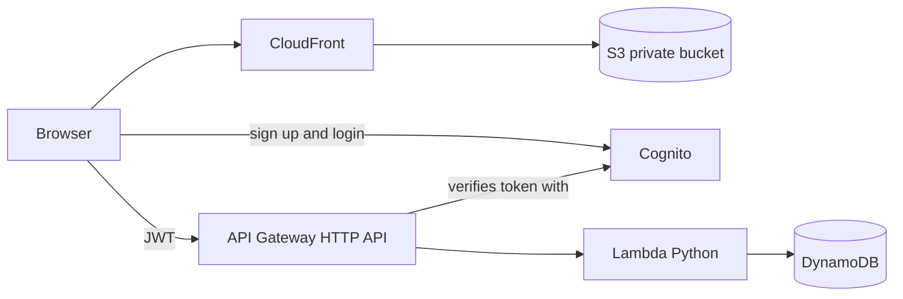

# Serverless Job Application Tracker

A small full-stack app on AWS where users sign up, log in, and track their job applications. The app is simple on purpose. The focus is the cloud architecture, security, and automation around it.

## Architecture



## Services and why

| Service | Role | Reason |
|---|---|---|
| S3 + CloudFront | Hosts the frontend | The bucket stays private and only CloudFront can read it (Origin Access Control) |
| Cognito | Users and login | Managed auth, so no passwords are stored by me |
| API Gateway | REST API | The JWT authorizer rejects bad tokens before Lambda runs |
| Lambda | Business logic | No servers to manage and near zero cost at low traffic |
| DynamoDB | Storage | Partition key is the user ID, so each user only reads their own data |
| Terraform | Infrastructure as code | The whole stack is reproducible with one command |
| GitHub Actions | CI/CD | Validates every push and can deploy from main |

## Security decisions

- Lambda's IAM role can only run three actions on one DynamoDB table.
- The user ID always comes from the verified token, never from the request body.
- The S3 bucket blocks all public access.
- Inputs are validated and length-limited in the Lambda.

## Deploy

1. Create an AWS account and open AWS CloudShell.
2. Install Terraform in CloudShell, then clone this repo.
3. Run:
```
   cd terraform
   terraform init
   terraform apply
```
4. Open the `site_url` output, sign up, confirm the email code, and add an application.
5. Remove everything when done with `terraform destroy`.

## Cost

Every service used here has a free tier or bills per request, so a demo costs close to nothing.

## Possible improvements

- Remote Terraform state in S3 with locking, so the pipeline can deploy
- CloudWatch alarms on Lambda errors
- A custom domain with Route 53 and ACM
- Unit tests for the Lambda using moto

## Screenshots

Add a screenshot of the running app here.
